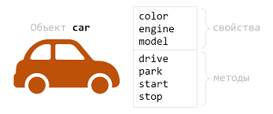
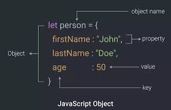
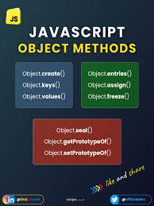
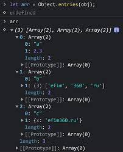
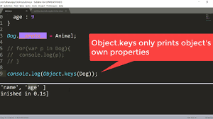
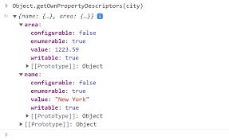
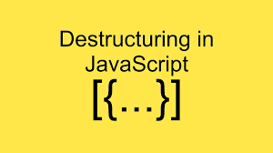
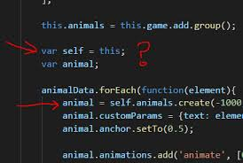

# Что такое Object в JS ?
Тип Object представляет один из типов данных JavaScript. Он используется для хранения различных коллекций с ключами и более сложных сущностей. Объекты могут быть созданы с использованием конструктора Object() или синтаксиса инициализатора / литерала объекта.

# Object в реальном жизни

# Как оформить Object в JS
Самый простой способ создать объект — это использовать фигурные скобки {}. Внутри фигурных скобок мы определяем свойства объекта и их значения. Например: let person = { firstName: "John", lastName: "Doe", age: 30 };

# Мтоды Object в JS

Все объекты JavaScript исходят из родительского конструктора Object. У него есть много полезных встроенных методов, которые могут упростить работу с отдельными объектами. В отличие от методов массивов, таких как sort() и reverse(), которые используются в экземпляре массива, методы объектов используются непосредственно в конструкторе Object и используют экземпляр объекта в качестве параметра. Такие методы называются статическими.

## Метод Object.create()
Метод Object.create() - возвращает массив пар [ключ, значение].

## Метод Object.keys()
Метод Object. keys возвращает массив строковых элементов, соответствующих именам перечисляемых свойств, найденных непосредственно в самом объекте. Порядок свойств такой же, как и при ручном перечислении свойств в объекте через цикл.

## Метод Object.values()
Метод Object.values() создает массив значений объекта.

# Что такое object Destructuring в JS?

Деструктуризация объектов JavaScript — это синтаксис для извлечения значений из свойства объекта и присвоения их переменной . Деструктуризация также возможна для массивов JavaScript. По умолчанию имя ключа объекта становится переменной, которая содержит соответствующее значение.

# Что такое object this в JS?

Кратко Грубо говоря, this — это ссылка на некий объект, к свойствам которого можно получить доступ внутри вызова функции. Этот this — и есть контекст выполнения.

# Be Happy and Smile !

